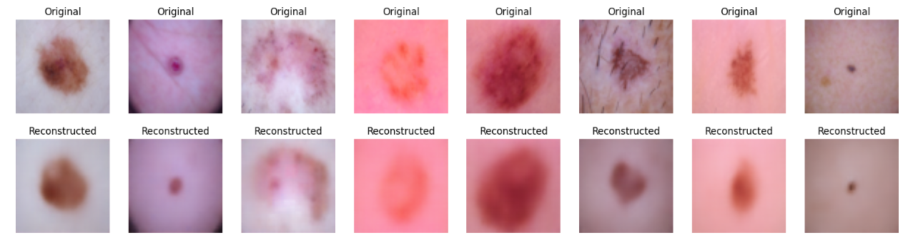
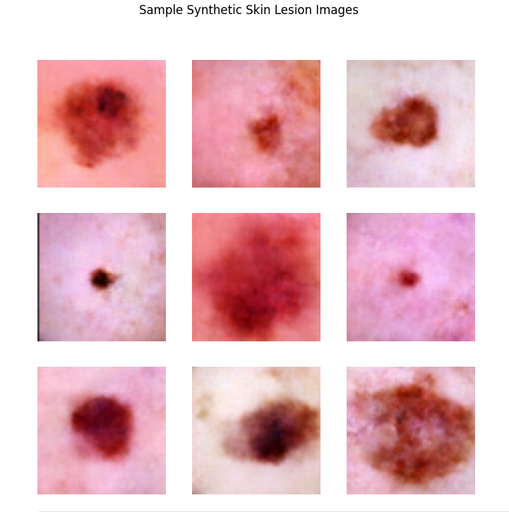
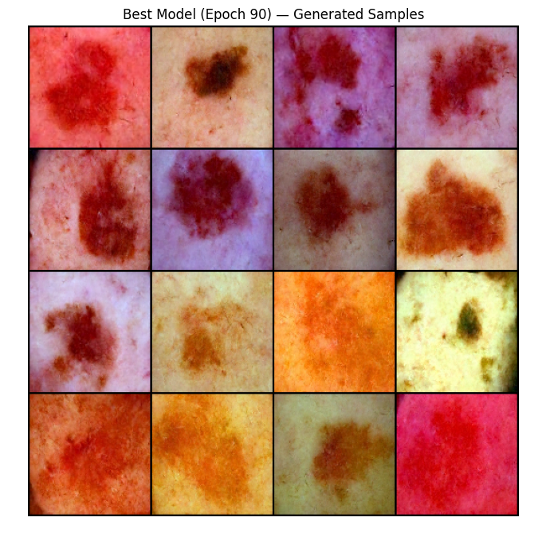

# Synthetic Data Generation for Skin Disease Classification

## Overview

This project explores the use of Generative AI and deep learning models to generate synthetic
skin-disease images and investigate their usefulness for downstream disease classification.

The project explores multiple generative approaches:

- Variational Autoencoder (VAE)
- Deep Convolutional GAN (DCGAN)
- Diffusion Models

A Vision Transformer (ViT) is used for image classification.

---

## Problem

Medical image datasets can be limited in size and diversity.

This project investigates whether synthetic images generated using modern generative models can
provide additional data for training and evaluating a skin-disease classification system.

---

## Approach

```text
Skin Disease Dataset
        │
        ├──────────────┐
        ↓              ↓
       VAE           DCGAN
        │              │
        └──────┬───────┘
               │
               ↓
         Diffusion Model
               │
               ↓
       Synthetic Images
               │
               ↓
       Vision Transformer
               │
               ↓
      Disease Classification
```
---
## Models

### 1. Variational Autoencoder (VAE)

Used to learn a latent representation of skin-disease images and generate new samples.

### 2. Deep Convolutional GAN (DCGAN)

Used to generate synthetic skin-disease images through adversarial training.

### 3. Diffusion Model

Used to generate synthetic images through an iterative denoising process.

### 4. Vision Transformer (ViT)

Used for downstream image classification and evaluation.

---

## Dataset

The project uses the **HAM10000 skin lesion dataset**.

The dataset contains dermatoscopic images of different skin-lesion categories and is used as the
basis for the synthetic data generation and classification experiments.

---

## Technologies

- Python
- Deep Learning
- Generative AI
- VAE
- DCGAN
- Diffusion Models
- Vision Transformers
- Computer Vision
- Medical Image Processing

---

## Project Structure

```text
.
├── DCGAN.ipynb
├── Diffusion.ipynb
├── VAE.ipynb
├── ViT_Classifier.ipynb
├── Project_Report.pdf
├── Project_Presentation.pdf
└── README.md
```

---
## How the Project Works

### Step 1 — Dataset

The skin-disease dataset is prepared and processed for model training.

### Step 2 — Synthetic Data Generation

Multiple generative models are explored:

- VAE
- DCGAN
- Diffusion Model

These models are used to generate synthetic skin-disease images.

### Step 3 — Image Classification

A Vision Transformer (ViT) is used to perform downstream image classification.

### Step 4 — Evaluation

The generated data and classification pipeline are evaluated to investigate the usefulness of
synthetic images for the classification task.

---

## Results

The project evaluates synthetic image generation using multiple image-quality
and distribution-related metrics.

### Diffusion Model

The best diffusion model checkpoint was obtained at **epoch 90**.

| Metric | Score |
|---|---:|
| SSIM | 0.2786 |
| MS-SSIM | 0.3326 |
| LPIPS | 0.5005 |

The diffusion experiment was evaluated using generated and real skin-disease images.

### GAN

The GAN experiment achieved an **Inception Score of 2.8207 ± 0.0724**.

### Generated Data

The VAE workflow generated **1,000 synthetic images** for further analysis and evaluation.

The diffusion workflow also used an augmented dataset of **20,000 images**, with a
**1,500-image subset** used for the training experiment.

> **Note:** These metrics are experimental results from the project notebooks and are intended
> for comparative analysis of the generated data rather than clinical evaluation.
---

## Tech Stack

### Machine Learning & Deep Learning
- Python
- PyTorch
- TensorFlow
- Hugging Face Diffusers

### Generative Models
- Variational Autoencoder (VAE)
- DCGAN
- Diffusion Models

### Computer Vision
- Vision Transformer (ViT)
- Image Classification
- SSIM
- MS-SSIM
- LPIPS
- Inception Score

### Dataset
- HAM10000 Skin Lesion Dataset

### Development Environment
- Google Colab
- NVIDIA T4 GPU
- Google Drive

---

## Notebooks

| Notebook | Description |
|---|---|
| [DCGAN](DCGAN.ipynb) | DCGAN-based synthetic skin-disease image generation |
| [Diffusion](Diffusion.ipynb) | Diffusion-based synthetic image generation |
| [VAE](VAE.ipynb) | VAE-based synthetic image generation |
| [ViT Classifier](ViT_Classifier.ipynb) | Vision Transformer-based image classification |

---

## Generated Samples

### VAE



### DCGAN



### Diffusion Model



## Research

**Generative AI based Synthetic Data Generation for Skin Disease Classification using VAE, GAN and Diffusion Models**

**Conference:** I3CTCON IEEE Conference

### Key Areas

- Generative AI
- Deep Learning
- Machine Learning
- Medical Image Processing
- Skin Disease Classification

---

## Key Learning

This project provided hands-on experience with multiple Generative AI approaches and their
application to medical image generation.

It also involved understanding how synthetic data can be incorporated into a downstream
computer-vision classification workflow.

---

## Future Improvements

- Improve synthetic image quality
- Perform more extensive quantitative evaluation
- Compare additional diffusion architectures
- Expand the classification experiments
- Build an interactive inference interface
- Deploy the generation and classification pipeline as an API
